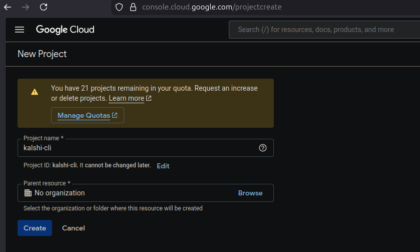
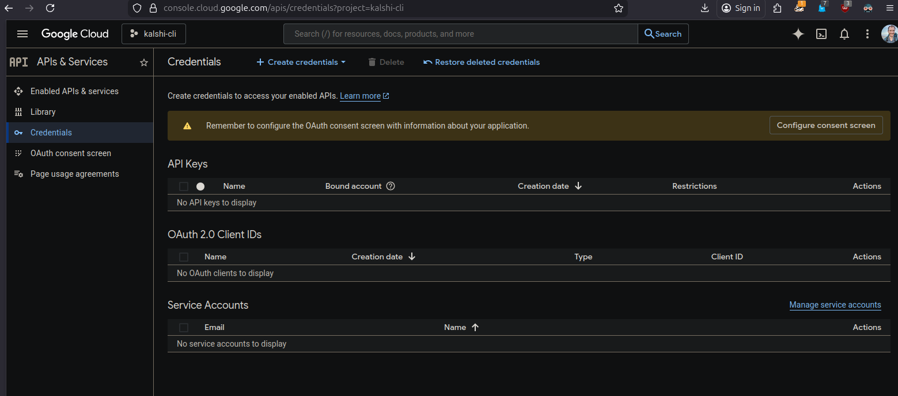
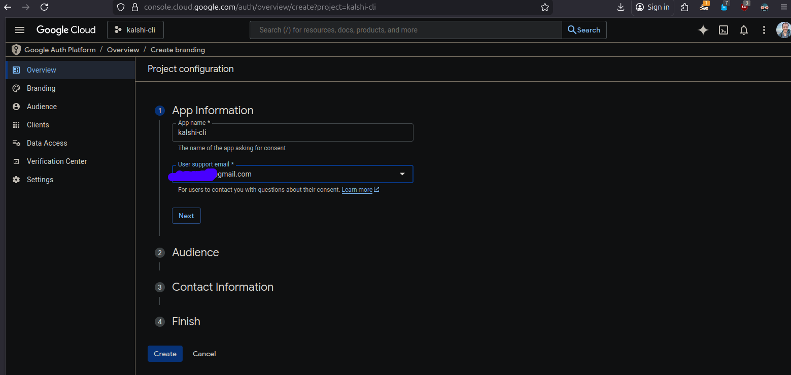
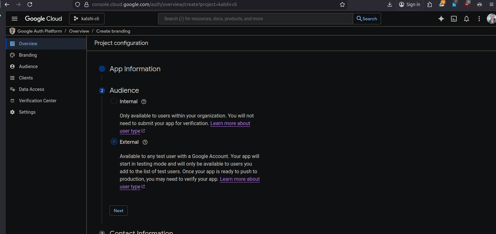
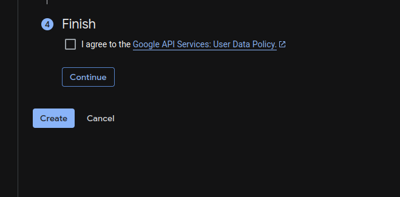
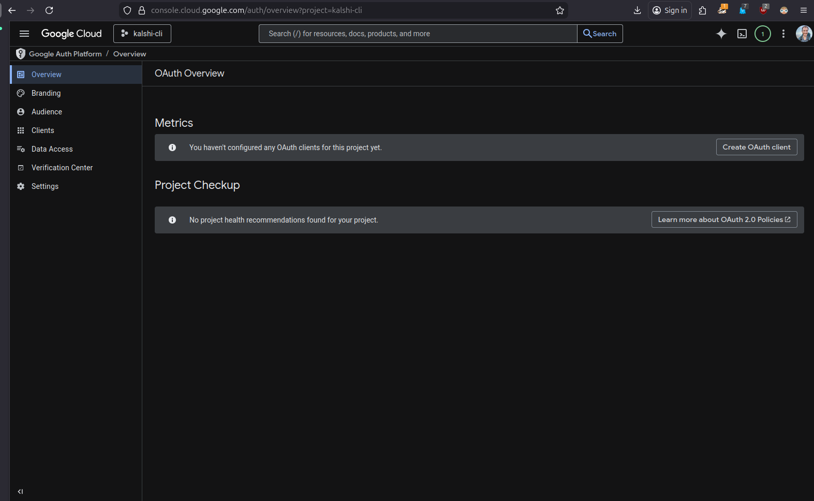

# kalshi-cli
This is a python cli that collects and cleans sports data from Kalshi and google sheets

# Setup   

## Software 
To run this locally you will need to install git and python. They can be installed from the following websites:
   


## Clone the code
Next you will need to copy (clone) the code from Github to your computer. To do that open a terminal, (command prompt on windows), navigate to the folder you want to store the code in using    

```shell 
cd path/to_folder 
```  

Then clone the code to your computer from github using:
```shell
git clone https://github.com/Russell-Shean/kalshi-cli
```
This will create a folder on your computer inside the path you already moved to using cd. In our example that would mean there would be a folder called path/to_folder/kalshi-cli

Finally move into the cloned folder using cd again
```shell
cd kalshi-cli
```

## Credentials
You will need to create two sets of credentials for this project: Kalshi and Google. Kalshi is very straightforward to setup and google is somewhat complicated. If you don't mind making the spreadsheet publicly visible, the google credentials setup steps can be completely skipped. 

## Kalshi

## Google
I am assuming that for this project you would like to keep the google sheet private, so in this section I will provide step-by-step instructions for creating google credentials. I am happy to also help on a live zoom session. 

1. <strong>Create a google project in Google Cloud Platform</strong>.        
The following link will take you to the correct page: https://console.cloud.google.com/projectcreate     

You will be prompted to login if you're not already logged into your google account. Then you should see a screen that looks like this:    



Change the name to "kalshi-cli". (You can choose whatever name you want, but using the same name as me may make it easier to follow this tutorial). 

You don't need to specify an organization unless you want to.    
   
Click create     

2. <strong>Create Credentials</strong>    
If you used the same project name as me (kalshi-cli), the following link should take you directly to the credentials page: https://console.cloud.google.com/apis/credentials?project=kalshi-cli      

(If you used a different project name you will need to edit  the ?project=kalshi-cli part of the url to your project name. The page can also be found under the api menu in google console)

You should see a screen that looks like this:      

    

Now click on the "configure consent screen" button in the top right corner, then you should see this page:    


Click "Get Started"    

You should then see a page that asks you to provide App Information. Under the App Name section enter "kalshi-cli" and then click on the User Support Email menu and choose your own email. Then click next to move to the next section.      

      
   
Under Audience select external and click next     

   

Under Contact Info enter your email again and click next    

    

Finally check the box to agree to the terms of service and click continue and then create

    

You should then be redirected to a page that looks like this. Under the "Metrics" section click on the "Create Oauth Client" button   

